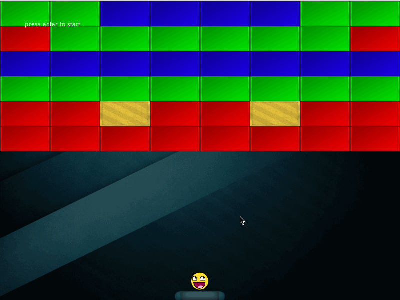

# BreakoutJava
A Java Clone of the Classic Atari Breakout Game.

Player's objective is to use the ball to eliminate as many blocks as possible, but he/she has to use the paddle to prevent the ball from falling. Press Enter to start. If you fails, the game will automatically reset to its original state.

Thank learnopengl.com for providing free image resources.

